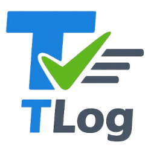

<div align="center">
  <picture>
    
  </picture>
</div>

[](https://github.com/tlog-dev/tlog/actions?query=workflow%3ACI)
[](https://coveralls.io/github/tlog-dev/tlog?branch=main)

TLog is a YAML-first test management product designed for teams that want test operations to be:

- version-controlled
- reviewable
- automation-friendly
- easy to evolve with AI assistance

Instead of hiding test process data inside proprietary storage, TLog keeps suite and case definitions in plain YAML so teams can track quality work with the same workflows they already use for source code.

## Product Concept

TLog is built around one practical idea:

"Test management should be transparent, diffable, and composable."

What this means in practice:

- **Test knowledge lives in files**: suites and cases are plain YAML in your repository.
- **Progress is explicit**: execution status and issues are first-class fields.
- **AI is an assistant, not a silo**: MCP tools help generate and maintain artifacts while preserving file ownership in Git.
- **One model, multiple interfaces**: VS Code extension, CLI, and MCP share the same schema and behavior.

## How TLog Is Organized

This monorepo has four main packages:

- VS Code Extension: `packages/vscode-extension`
- CLI: `packages/cli`
- MCP Server: `packages/mcp`
- Shared Domain/Schema: `packages/shared`

Package-specific usage and configuration are documented in each package README:

- VS Code Extension guide: [`packages/vscode-extension/README.md`](packages/vscode-extension/README.md)
- CLI guide: [`packages/cli/README.md`](packages/cli/README.md)
- MCP guide: [`packages/mcp/README.md`](packages/mcp/README.md)
- Shared schema/domain notes: [`packages/shared/README.md`](packages/shared/README.md)

## Learn by Example

The fastest way to understand the TLog model is to inspect the example workspace:

- Root suite: [`example/tests/index.yaml`](example/tests/index.yaml)
- Child suites and cases: [`example/tests`](example/tests)

Suggested reading path:

1. Open [`example/tests/index.yaml`](example/tests/index.yaml)
2. Open one suite index (for example [`example/tests/suite-01/index.yaml`](example/tests/suite-01/index.yaml))
3. Open one case file (for example [`example/tests/suite-01/s01-c01.yaml`](example/tests/suite-01/s01-c01.yaml))

You will see how TLog models:

- suite planning windows (`duration`)
- case execution state (`status`, `completedDay`)
- issue tracking (`incident`, `status`, `detectedDay`, `completedDay`)
- related links between entities (`related`)

## First 5 Minutes

Use this section to get a quick feel for TLog before reading full package docs.

### 1) Create sample test assets with CLI

```bash
npx @tlog/cli init --output tests
npx @tlog/cli suite create --dir tests --id quickstart --title "Quickstart Suite"
npx @tlog/cli case create --suite-dir tests/quickstart --id quickstart-case --title "Quickstart Case"
npx @tlog/cli validate --dir tests
```

### 2) Inspect real-world examples

Open these files and compare structure/fields:

- [`example/tests/index.yaml`](example/tests/index.yaml)
- [`example/tests/suite-01/index.yaml`](example/tests/suite-01/index.yaml)
- [`example/tests/suite-01/s01-c01.yaml`](example/tests/suite-01/s01-c01.yaml)

### 3) Connect MCP server (optional)

Run the MCP server with stdio transport:

```bash
npx @tlog/mcp --stdio
```

Then configure your MCP client using the examples in:

- [`packages/mcp/README.md`](packages/mcp/README.md)

### 4) Use the VS Code experience (optional)

See extension usage/setup in:

- [`packages/vscode-extension/README.md`](packages/vscode-extension/README.md)

### Where to Go Next

- CLI deep usage: [`packages/cli/README.md`](packages/cli/README.md)
- MCP tools and client setup: [`packages/mcp/README.md`](packages/mcp/README.md)
- VS Code workflows: [`packages/vscode-extension/README.md`](packages/vscode-extension/README.md)

## Development at Repository Root

```bash
npm install
npm run typecheck
npm run build
npm run test
```

## Contributing

If you plan to contribute, please use the issue and merge request templates provided in this repository.

### Create a GitHub Issue

1. Open the repository's **Issues** tab.
2. Click **New issue**.
3. Choose one of the templates:
   - `Bug Report`
   - `Feature Request`
4. Fill all required sections (context, expected behavior, reproduction steps, impact).

Issue templates are stored under:

- [`.github/ISSUE_TEMPLATE/bug_report.md`](.github/ISSUE_TEMPLATE/bug_report.md)
- [`.github/ISSUE_TEMPLATE/feature_request.md`](.github/ISSUE_TEMPLATE/feature_request.md)

### Create a Merge Request (Pull Request)

1. Create a feature branch from `main`.
2. Commit related changes with clear messages.
3. Open a Pull Request to `main`.
4. Follow the PR template checklist before requesting review.

PR template location:

- [`.github/PULL_REQUEST_TEMPLATE.md`](.github/PULL_REQUEST_TEMPLATE.md)

## CI/CD

- CI workflow: [`.github/workflows/ci.yml`](.github/workflows/ci.yml)
- Release workflow: [`.github/workflows/release.yml`](.github/workflows/release.yml)
