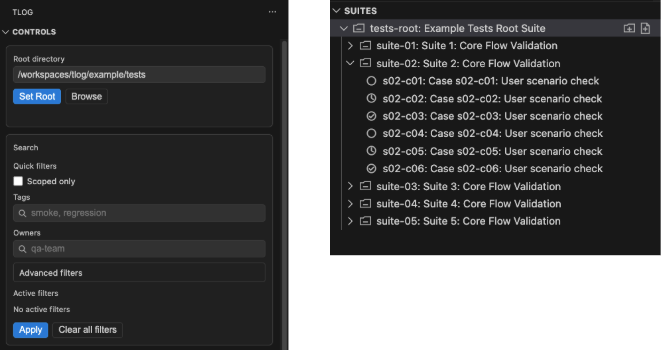
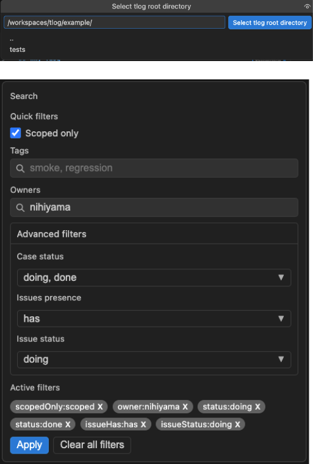
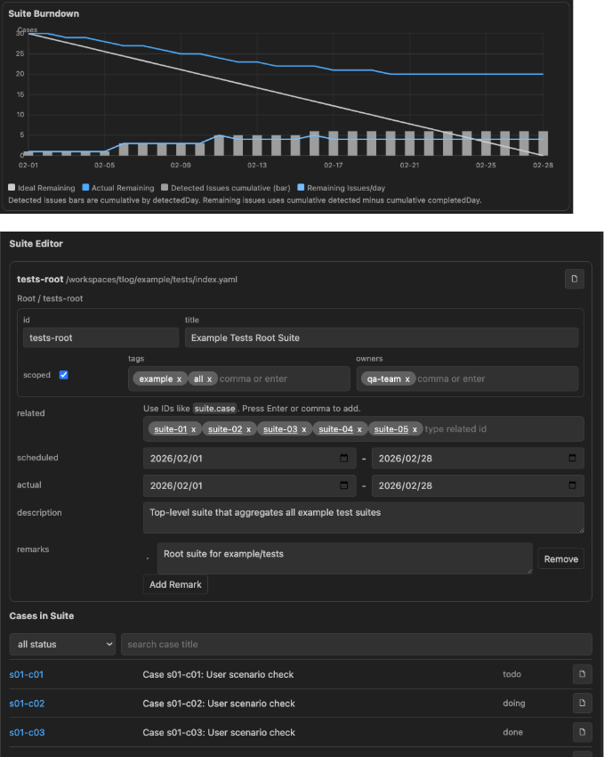
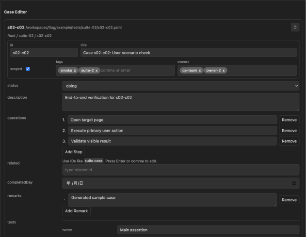

# TLog for Visual Studio Code

YAML-first test management for the `tlog` workflow.

TLog adds a dedicated Activity Bar view for browsing suites/cases, filtering execution progress, editing YAML through a structured manager UI, and validating suite/case files in real time.



## Why TLog

- Keep test management data in plain YAML files.
- Track progress with `todo` / `doing` / `done` status and issue states.
- Navigate quickly between suites, cases, and related entities.
- Edit large case/suite payloads with form-style UI instead of manual YAML edits.

## Requirements

- VS Code `^1.90.0`
- A workspace containing TLog YAML files (`index.yaml` and case `*.yaml` files)

## Quick Start

1. Open your project folder in VS Code.
2. Open the `TLog` view from the Activity Bar.
3. Set a TLog root directory from `Controls`:
   - `Set Root` with a typed path, or
   - `Browse` to pick a folder.
4. Use the `Suites` tree to open a suite/case in `TLog Manager`.
5. Edit fields in the manager. Changes are auto-saved to YAML.



## Core Features

### 1) TLog Sidebar: Controls + Suites Tree

The extension contributes a custom Activity Bar container named `TLog` with two views:

- `Controls` (webview)
  - Root directory selection
  - Search/filter UI
  - Active filter chips with one-click removal
- `Suites` (tree view)
  - Hierarchical suite/case browsing from filesystem
  - Status-based icons
  - Context menu actions for creation, opening YAML, deletion, etc.

Tree behavior highlights:

- Suite nodes are discovered from `index.yaml` and `*.suite.yaml`.
- Case nodes are discovered from sibling `*.yaml` files.
- Suite icon changes when all direct cases are `done`.
- Clicking a suite/case opens `TLog Manager` for that entity.

### 2) Powerful Filtering

Filters are applied from the `Controls` webview and stored in workspace state:

- `scopedOnly`
- `tags` (comma-separated)
- `owners` (comma-separated; matched against suite owners)
- Case status: `todo`, `doing`, `done`
- Issue presence: `has`, `none`
- Issue status: `open`, `doing`, `resolved`, `pending`

Filter UX details:

- Advanced filters use multi-select dropdown panels.
- Active filters are shown as chips and removable individually.
- `Clear all filters` resets everything to defaults.

### 3) TLog Manager (Webview Panel)

`TLog Manager` is a persistent editor panel (`retainContextWhenHidden: true`) with two editing modes.

#### Suite editor

Editable fields include:

- `title`, `description`
- `tags`, `owners`, `scoped`
- `duration.scheduled.start/end`
- `duration.actual.start/end`
- `related`
- `remarks`

Additional suite tools:

- YAML open button
- Suite burndown visualization
- Embedded list of cases in the suite with status filter + text search

#### Case editor

Editable fields include:

- `title`, `description`, `scoped`, `status`
- `tags`
- `operations` (ordered list)
- `related`
- `completedDay` (date input)
- `remarks`
- `tests[]`
  - `name`, `expected`, `actual`, `trails[]`, `status(pass|fail|skip|block|null)`
- `issues[]`
  - `incident`, `owners[]`, `causes[]`, `solutions[]`, `status`
  - `detectedDay`, `completedDay`, `related[]`, `remarks[]`

Editor behavior:

- Save is auto-triggered on field changes (debounced).
- Save status is shown in panel header (`saving`, `saved`, `error`).
- Related references are normalized against known IDs.





### 4) Diagnostics for YAML Files

The extension validates YAML on open/save/change:

- Suite files (`index.yaml` or `*.suite.yaml`) are validated as `Suite`
- Other `.yaml` files are validated as `TestCase`
- Errors are reported as VS Code diagnostics

### 5) Related Navigation

From a suite/case node:

- `Open Related` resolves `related` IDs from the workspace index
- Choose a target from quick pick
- Open the related YAML directly

### 6) Safe Deletion

`Delete` from tree context menu:

- Case: deletes YAML file
- Suite: deletes whole suite directory recursively
- Uses Trash first, falls back to hard delete only if trash is unavailable

## Commands

The extension registers these operational commands:

- `tlog.selectRoot` (`TLog: Set Root`)
- `tlog.searchTags` (`TLog: Search Tags`)
- `tlog.searchOwners` (`TLog: Search Owners`)
- `tlog.clearSearch` (`TLog: Clear Search`)
- `tlog.createSuite` (`Create Suite`)
- `tlog.createCase` (`Create Case`)
- `tlog.openManager` (`TLog: Open Manager`)
- `tlog.refreshTree` (`TLog: Refresh Tree`)
- `tlog.showSuiteStats` (`TLog: Show Suite Statistics`)
- `tlog.openRelated` (`TLog: Open Related`)
- `tlog.openRawYaml` (`Open YAML`)
- `tlog.deleteNode` (`Delete`)

Context menu commands are available in the `Suites` tree for suite/case nodes.

## Settings

- `tlog.scopeMode`: `recursive | currentOnly` (default: `recursive`)

## File Model Assumptions

- Root folder must contain suite files (`index.yaml` and/or `*.suite.yaml`).
- Cases are YAML files in suite directories.
- Entity IDs must match `[A-Za-z0-9_-]+` when creating new suite/case.
- Duplicate IDs are rejected at creation time.

## Development

From `packages/vscode-extension`:

```bash
npm run typecheck
npm run test
npm run build
```

Packaging and release helpers:

```bash
npm run package:vsix
npm run publish:precheck
npm run publish:marketplace
```

## Known Gaps (Current Implementation)

- `tlog.filterCases` is contributed in `package.json` but not currently registered in `src/extension.ts`.
- `tlog.scopeMode` is contributed as a setting but not currently consumed in runtime logic.

## License

See `LICENSE`.
