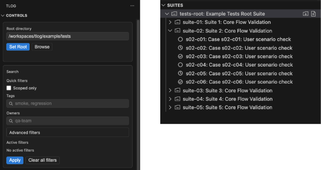
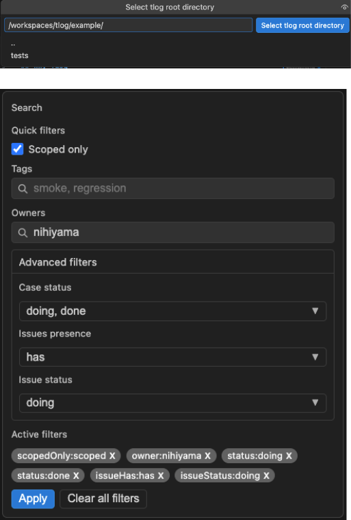
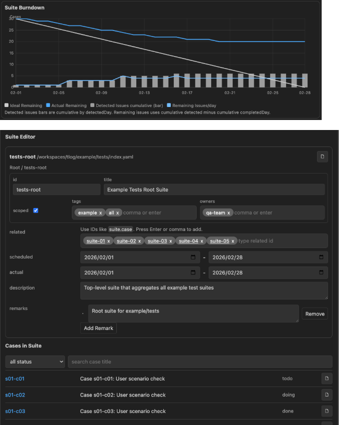
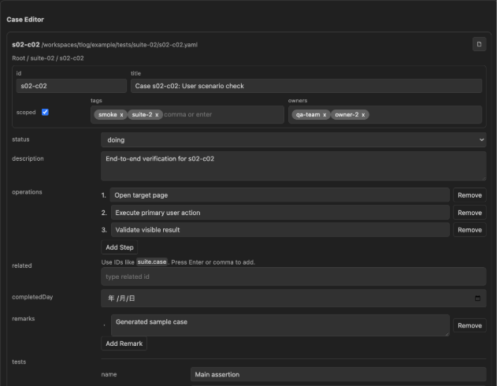

# TLog for Visual Studio Code

YAML-first test management for the `tlog` workflow.

TLog adds a dedicated Activity Bar view for browsing suites/cases, filtering execution progress, editing YAML through a structured manager UI, and validating suite/case files in real time.



## Why TLog

- Keep test management data in plain YAML files.
- Track progress with `todo` / `doing` / `done` status and issue states.
- Navigate quickly between suites, cases, and related entities.
- Edit large case/suite payloads with form-style UI instead of manual YAML edits.

## Language Support

TLog follows the VS Code display language and currently supports:

- English (`en`), which is also the fallback language
- Japanese (`ja`)

To switch languages, run the VS Code `Configure Display Language` command, select the language, and restart VS Code or reload the window. Unsupported locales and missing translations fall back to English. TLog command IDs, setting keys, YAML fields, and enum values do not change with the display language.

Translation architecture, terminology, the user-facing text inventory, and contributor instructions are documented in [`docs/localization.md`](./docs/localization.md).

Localized Webviews avoid DOM translation work when the active language uses the original English strings, and deduplicate translated mutation processing to keep initial rendering responsive.

## Requirements

- VS Code `^1.90.0`
- A workspace containing TLog YAML files (`index.yaml` and case `*.yaml` files)

## Quick Start

1. Open your project folder in VS Code.
2. Open the `TLog` view from the Activity Bar.
3. Set a TLog root directory from `Controls`:
   - `Set Root` with a typed path, or
   - `Browse` to pick a folder.
4. Use the `Suites` tree to open a suite/case in `TLog Manager`.
5. Edit fields in the manager. Unsaved changes stay in the VS Code document until you save with the Manager Save button, `Ctrl+S` / `Cmd+S`, or configured Auto Save.



## Core Features

### 1) TLog Sidebar: Controls + Suites Tree

The extension contributes a custom Activity Bar container named `TLog` with two views:

- `Controls` (webview)
  - Root directory selection
  - Search/filter UI
  - Active filter chips with one-click removal
  - Compact action buttons for setting or browsing the root and applying or clearing filters
- `Suites` (tree view)
  - Hierarchical suite/case browsing from filesystem
  - Status-based icons
  - Context menu actions for creation, opening YAML, deletion, etc.

Tree behavior highlights:

- Suite nodes are discovered from `index.yaml` and `*.suite.yaml`.
- Case nodes are discovered from sibling `*.yaml` files.
- Case and suite icons are color-coded by execution status, with suite colors derived from aggregated case status.
- Clicking a suite/case opens `TLog Manager` for that entity.

### 2) Powerful Filtering

Filters are applied from the `Controls` webview and stored in workspace state:

- `scopedOnly`
- `tags` (comma-separated)
- `owners` (comma-separated; matched against suite owners)
- Case status: `todo`, `doing`, `done`
- Issue presence: `has`, `none`
- Issue status: `open`, `doing`, `resolved`, `pending`

Filter UX details:

- Advanced filters use multi-select dropdown panels.
- Active filters are shown as chips and removable individually.
- `Clear all filters` resets everything to defaults.
- Case tag matching includes tags inherited from ancestor suites without copying those tags into editable case data.

### 3) TLog Manager (Custom Text Editor)

`TLog Manager` is a VS Code custom text editor with one tab per YAML file. Opening another suite or case creates or reveals its own Manager tab, so unsaved work in the current tab is preserved.

#### Suite editor

Editable fields include:

- `title`, `description`
- `tags`, `owners`, `scoped`
- `duration.scheduled.start/end`
- `duration.actual.start/end`
- `related`
- `remarks`

Additional suite tools:

- YAML open button
- Suite burndown visualization synchronized with the active Controls filters and inherited suite/case scope
- Embedded list of cases in the suite with status filter + text search

Burndown and statistics behavior:

- Scoped totals, status counts, completed and remaining counts, progress rate, and daily remaining series use the same shared calculation rules.
- Cases below an ancestor suite with `scoped: false` are excluded, and an explicit no-target state is shown when no scoped cases match.
- Cases with `status: done` are included in KPI completion counts even when `completedDay` is missing or outside the scheduled period; out-of-range completion dates are folded into the chart boundary buckets.
- `TLog: Show Suite Statistics` uses the same recursive scope, active filters, and completion dates as the Manager burndown.

#### Case editor

Editable fields include:

- `title`, `description`, `scoped`, `status`
- `tags`
- `operations` (ordered list)
- `related`
- `completedDay` (date input)
- `remarks`
- `tests[]`
  - `name`, `expected`, `actual`, `trails[]`, `status(pass|fail|skip|block|null)`
- `issues[]`
  - `incident`, `owners[]`, `causes[]`, `solutions[]`, `status`
  - `detectedDay`, `completedDay`, `related[]`, `remarks[]`

Editor behavior:

- Field changes update an in-memory VS Code `TextDocument` and show the standard dirty indicator without writing YAML immediately.
- Save from the button next to `Open YAML`, with `Ctrl+S` / `Cmd+S`, or through configured VS Code Auto Save.
- Closing a dirty tab uses VS Code's standard Save / Don't Save / Cancel flow.
- Standard VS Code undo / redo, discard, backup, and hot exit behavior applies.
- Save status is shown in the panel header (`saving`, `saved`, `error`).
- Related references are normalized against known IDs when the document draft is updated.





### 4) Diagnostics for YAML Files

The extension validates YAML on open/save/change:

- Suite files (`index.yaml` or `*.suite.yaml`) are validated as `Suite`
- Other `.yaml` files are validated as `TestCase`
- Errors are reported as VS Code diagnostics

### 5) Related Navigation

From a suite/case node:

- `Open Related` resolves `related` IDs from the workspace index
- Choose a target from quick pick
- Open the related YAML directly

### 6) Safe Deletion

`Delete` from tree context menu:

- Case: deletes YAML file
- Suite: deletes whole suite directory recursively
- Uses Trash first, falls back to hard delete only if trash is unavailable

## Commands

The extension registers these operational commands:

- `tlog.selectRoot` (`TLog: Set Root`)
- `tlog.searchTags` (`TLog: Search Tags`)
- `tlog.searchOwners` (`TLog: Search Owners`)
- `tlog.clearSearch` (`TLog: Clear Search`)
- `tlog.createSuite` (`Create Suite`)
- `tlog.createCase` (`Create Case`)
- `tlog.openManager` (`TLog: Open Manager`)
- `tlog.refreshTree` (`TLog: Refresh Tree`)
- `tlog.showSuiteStats` (`TLog: Show Suite Statistics`)
- `tlog.openRelated` (`TLog: Open Related`)
- `tlog.openRawYaml` (`Open YAML`)
- `tlog.deleteNode` (`Delete`)

Context menu commands are available in the `Suites` tree for suite/case nodes.

## Settings

- `tlog.scopeMode`: `recursive | currentOnly` (default: `recursive`)

## File Model Assumptions

- Root folder must contain suite files (`index.yaml` and/or `*.suite.yaml`).
- Cases are YAML files in suite directories.
- Entity IDs must match `[A-Za-z0-9_-]+` when creating new suite/case.
- Duplicate IDs are rejected at creation time.

## Development

From `packages/vscode-extension`:

```bash
npm run typecheck
npm run test
npm run build
```

Packaging and release helpers:

```bash
npm run package:vsix
npm run publish:precheck
npm run publish:marketplace
```

## Known Gaps (Current Implementation)

- `tlog.filterCases` is contributed in `package.json` but not currently registered in `src/extension.ts`.
- `tlog.scopeMode` is contributed as a setting but not currently consumed in runtime logic.

## License

See `LICENSE`.
